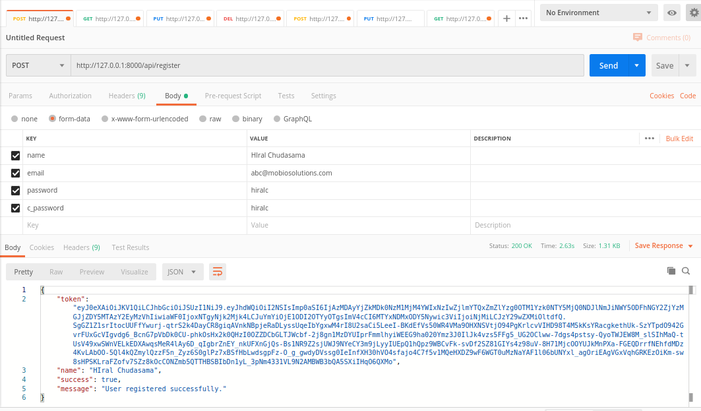
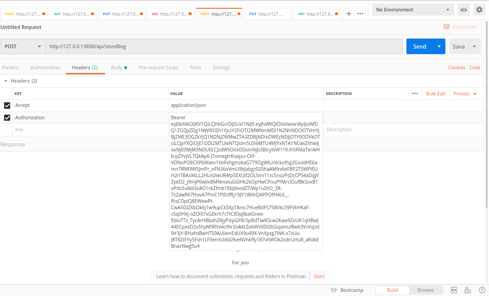
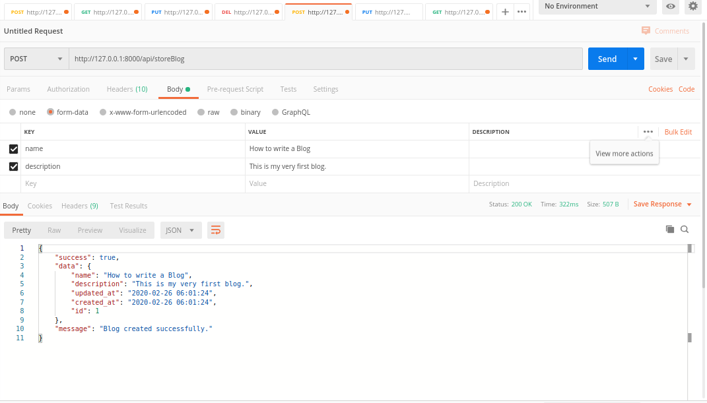
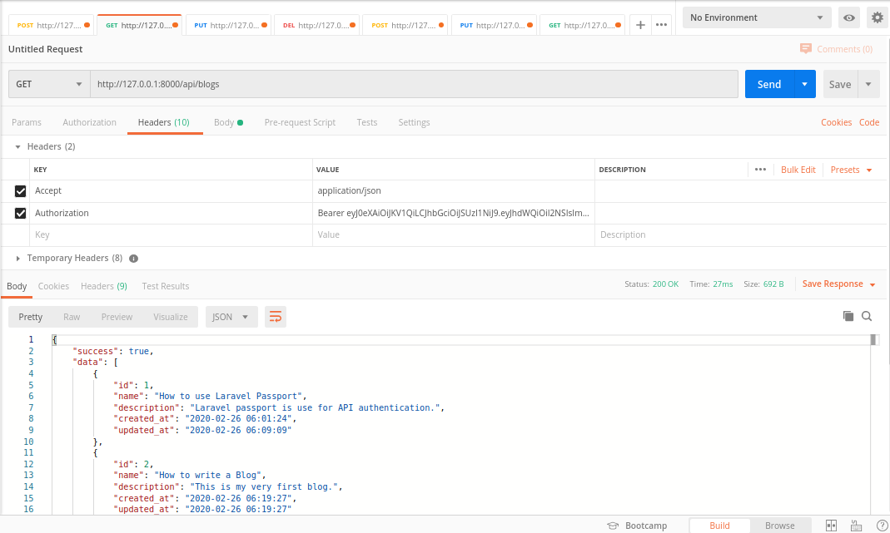
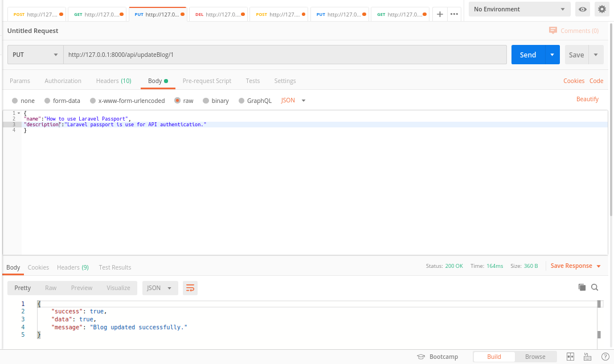
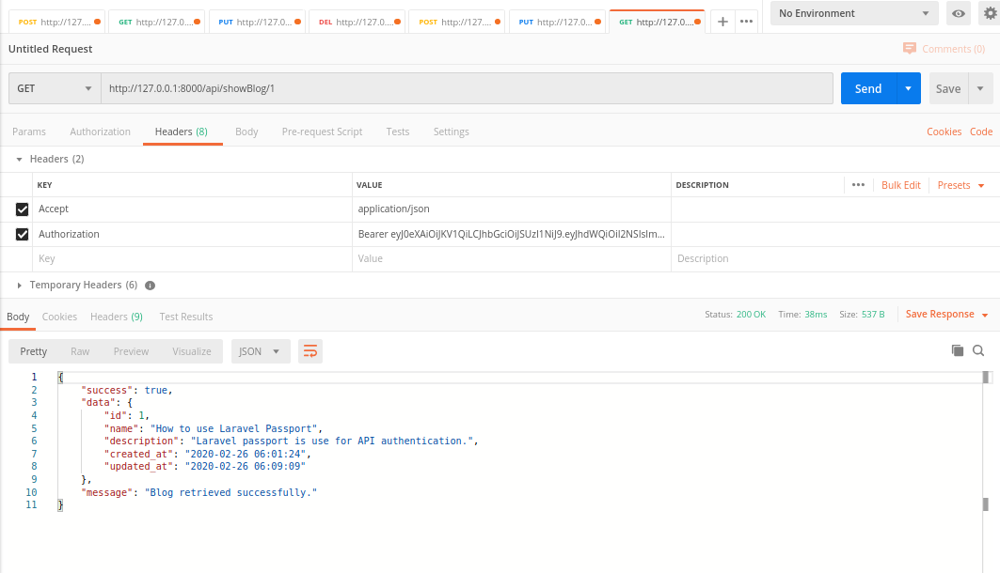
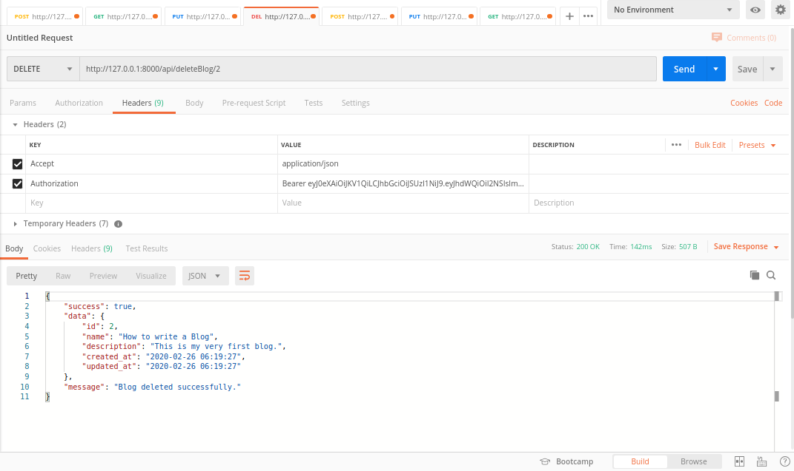

## **Laravel REST API with Passport**

Here, we are going to implement REST API with Passport authentication. 
We will build a CRUD for Blog's API using Laravel Passport Authentication.

#### **What is REST API?**
Rest API (Representational State Transfer) api's are web standards-based architecture and uses HTTP Protocol for exchanging data between applications or systems. 
In RESTFUL web service HTTP methods like GET, POST, PUT and DELETE can be used to perform CRUD operations.

#### **What is Passport?**
Laravel makes API authentication a breeze using Laravel Passport. APIs typically use tokens to authenticate users and do not maintain session state between requests.
you can use passport for user authentication for api's.

#### **Why should we use Passport?**
Passport provides a full OAuth2 server implementation for your Laravel application in a matter of minutes.
It was built to make it easy to apply authentication over an API for laravel based web applications. 
The passport package will register its own database migrations. This command will create the encryption keys needed to generate secure access tokens.

#### **How to implement Passport in REST API?**
In below example, we will create CRUD operation for Blog's API using passport authentication.

**1) Create laravel project.**

        composer create-project --prefer-dist laravel/laravel laraRestApi
        
**2) Install Passport**

Go to your project path in terminal and run below command for passport authentication.
        
        composer require laravel/passport
        
After the successful installation of a package, we required to get default migration for creating new passport tables in our database.  let's run below command:

    php artisan migrate
    
Next, we need to install the Passport using command, and it will create token keys for security. let's run bellow command:

    php artisan passport:install
        
**3) Configure project for passport.**

In user model, use HasApiTokens trait class of passport.

    namespace App;
    
    use Illuminate\Contracts\Auth\MustVerifyEmail;
    use Illuminate\Foundation\Auth\User as Authenticatable;
    use Illuminate\Notifications\Notifiable;
    use Laravel\Passport\HasApiTokens;
    
    class User extends Authenticatable
    {
        use Notifiable,HasApiTokens;
    
        /**
         * The attributes that are mass assignable.
         *
         * @var array
         */
        protected $fillable = [
            'name', 'email', 'password',
        ];
    
        /**
         * The attributes that should be hidden for arrays.
         *
         * @var array
         */
        protected $hidden = [
            'password', 'remember_token',
        ];
    
        /**
         * The attributes that should be cast to native types.
         *
         * @var array
         */
        protected $casts = [
            'email_verified_at' => 'datetime',
        ];
    }
    
Add "Passport::routes()" In AuthServiceProvider.

    namespace App\Providers;    
    
    use Laravel\Passport\Passport;
    use Illuminate\Support\Facades\Gate;
    use Illuminate\Foundation\Support\Providers\AuthServiceProvider as ServiceProvider;
    
    
    class AuthServiceProvider extends ServiceProvider
    {
        /**
         * The policy mappings for the application.
         *
         * @var array
         */
        protected $policies = [
            'App\Model' => 'App\Policies\ModelPolicy',
        ];
    
    
        /**
         * Register any authentication / authorization services.
         *
         * @return void
         */
        public function boot()
        {
            $this->registerPolicies();
    
    
            Passport::routes();
        }
    }

Change config/auth.php file.

    return [
        .....
        'guards' => [
            'web' => [
                'driver' => 'session',
                'provider' => 'users',
            ],
            'api' => [
                'driver' => 'passport',
                'provider' => 'users',
            ],
        ],
        .....
    ]
    
**4) Create Blog table and model**

Create migration file and model for the Blog table by below command.

    php artisan make:migration create_blogs_table
    
    php artisan make:model Blog
    
Now open your database/migration/'your blog migration file'. and add your code here

    <?php
    
    use Illuminate\Database\Migrations\Migration;
    use Illuminate\Database\Schema\Blueprint;
    use Illuminate\Support\Facades\Schema;
    
    class CreateBlogsTable extends Migration
    {
        /**
         * Run the migrations.
         *
         * @return void
         */
        public function up()
        {
            Schema::create('blogs', function (Blueprint $table) {
                $table->increments('id');
                $table->string('name');
                $table->text('description');
                $table->timestamps();
            });
        }
    
        /**
         * Reverse the migrations.
         *
         * @return void
         */
        public function down()
        {
            Schema::dropIfExists('blogs');
        }
    }
    
 Update below code to your Blog model file.
 
    <?php
    
    namespace App;
    
    use Illuminate\Database\Eloquent\Model;
    
    class Blog extends Model
    {
        /**
         * The attributes that are mass assignable.
         *
         * @var array
         */
        protected $fillable = [
            'name', 'description'
        ];
    }
    
**5) Add api routes to your `routes/api.php` file.**

        Route::middleware('auth:api')->group( function () {
        
        });
        
**6) Create Controller files**

Create two controller files. One for Register and another for Blog. Use below commands to create files.

           php artisan make:controller RegisterController
           
           php artisan make:controller BlogController      
           
Update below code to register Controller.

    <?php
    
    
    namespace App\Http\Controllers\API;
    
    use Illuminate\Http\Request;
    use App\Http\Controllers\Controller as Controller;
    use App\User;
    use Validator;
    class RegisterController extends Controller
    {
        /**
         * Register api
         *
         * @return \Illuminate\Http\Response
         */
        public function register(Request $request)
        {
            //Validate requested data
            $validator = Validator::make($request->all(), [
                'name' => 'required',
                'email' => 'required|email',
                'password' => 'required',
                'c_password' => 'required|same:password',
            ]);
    
    
            if($validator->fails()){
                return $this->sendError('Validation Error.', $validator->errors());
            }
    
    
            $input = $request->all();
            $input['password'] = bcrypt($input['password']);
            $user = User::create($input);
            $response['token'] =  $user->createToken('laraRestApi')->accessToken;
            $response['name'] =  $user->name;
            $response['success'] = true;
            $response['message'] = "User registered successfully.";
            return $response;
        }
    }
    
Update below code to BlogController

    <?php
    
    namespace App\Http\Controllers\API;
    
    use Illuminate\Http\Request;
    use Validator;
    use App\Blog;
    use App\Http\Controllers\Controller as Controller;
    
    class BlogController extends Controller
    {
        /**
         * Display a listing of the resource.
         *
         * @return \Illuminate\Http\Response
         */
        public function index()
        {
            //Get list of blogs
            $blogs = Blog::all();
            $message = 'Blogs retrieved successfully.';
            $status = true;
    
            //Call function for response data
            $response = $this->response($status, $blogs, $message);
            return $response;
        }
    
        /**
         * Store a newly created blog in database.
         *
         * @param \Illuminate\Http\Request $request
         * @return \Illuminate\Http\Response
         */
        public function store(Request $request)
        {
            //Get request data
            $input = $request->all();
    
            //Validate requested data
            $validator = Validator::make($input, [
                'name' => 'required',
                'description' => 'required'
            ]);
            if ($validator->fails()) {
                return $this->sendError('Validation Error.', $validator->errors());
            }
            $blog = Blog::create($input);
            $message = 'Blog created successfully.';
            $status = true;
    
            //Call function for response data
            $response = $this->response($status, $blog, $message);
            return $response;
        }
    
        /**
         * Update the specified blog in storage.
         *
         * @param \Illuminate\Http\Request $request
         * @param int $id
         * @return \Illuminate\Http\Response
         */
        public function update(Request $request, $id)
        {
            //Get request data
            $input = $request->all();
    
            //Validate requested data
            $validator = Validator::make($input, [
                'name' => 'required',
                'description' => 'required'
            ]);
            if ($validator->fails()) {
                $message = $validator->errors();
                $blog = [];
                $status = 'fail';
                $response = $this->response($status, $blog, $message);
                return $response;
            }
    
            //Update blog
            $blog = Blog::find($id)->update(['name' => $input['name'], 'description' => $input['description']]);
            $message = 'Blog updated successfully.';
            $status = true;
    
            //Call function for response data
            $response = $this->response($status, $blog, $message);
            return $response;
        }
    
        /**
         * Display the specified blog.
         *
         * @param int $id
         * @return \Illuminate\Http\Response
         */
        public function show($id)
        {
            $blog = Blog::find($id);
    
            //Check if the blog found or not.
            if (is_null($blog)) {
                $message = 'Blog not found.';
                $status = false;
                $response = $this->response($status, $blog, $message);
                return $response;
            }
            $message = 'Blog retrieved successfully.';
            $status = true;
    
            //Call function for response data
            $response = $this->response($status, $blog, $message);
            return $response;
        }
    
        /**
         * Remove the specified blog from storage.
         *
         * @param int $id
         * @return \Illuminate\Http\Response
         */
        public function destroy($id)
        {
            //Delete blog
            $blog = Blog::findOrFail($id);
            $blog->delete();
            $message = 'Blog deleted successfully.';
            $status = true;
    
            //Call function for response data
            $response = $this->response($status, $blog, $message);
            return $response;
        }
    
        /**
         * Response data
         *
         * @param $status
         * @param $blog
         * @param $message
         * @return \Illuminate\Http\Response
         */
        public function response($status, $blog, $message)
        {
            //Response data structure
            $return['success'] = $status;
            $return['data'] = $blog;
            $return['message'] = $message;
            return $return;
        }
    }

**7) Add routes**

Now add routes to `routes/api.php` file like below:

    Route::middleware('auth:api')->group( function () {
        Route::get('blogs', 'API\BlogController@index');
        Route::post('storeBlog', 'API\BlogController@store');
        Route::put('updateBlog/{id}', 'API\BlogController@update');
        Route::get('showBlog/{id}', 'API\BlogController@show');
        Route::delete('deleteBlog/{id}', 'API\BlogController@destroy');
    });

Now run below command in terminal:

    php artisan serve
    
**8) Run APIs**
    
Let's run API through postman.

Run authentication API to get passport access token & copy the token and use the same in Header of other CRUD APIs.
Follow all screenshots to understand how to generate a token and use it in APIs to authenticate a user.

Test Register API:

Add Blog:

List Blogs:

Update Blog:

View perticular blog:

Delete Blog:

Writing test cases for the register and CRUD APIs.

Commands to create test case file :

    php artisan make:test RegisterTest
    
    php artisan make:test BlogTest
    
Update below code to `tests/Feature/RegisterTest.php` file.

    <?php
    
    namespace Tests\Feature;
    
    use Illuminate\Foundation\Testing\WithFaker;
    use Tests\TestCase;
    use Laravel\Passport\ClientRepository;
    use Illuminate\Support\Facades\DB;
    use DateTime;
    
    class RegisterTest extends TestCase
    {
        use WithFaker;
    
        public function setUp(): void
        {
            parent::setUp();
            DB::beginTransaction();
        }
    
        public function tearDown(): void
        {
            DB::rollback();
            parent::tearDown();
        }
    
        /**
         * Test Register api
         *
         * @return void
         */
        public function testRegisterApi()
        {
            //Need to create test personal access token for authentication
            $clientRepository = new ClientRepository();
            $client = $clientRepository->createPersonalAccessClient(
                null, 'Test Personal Access Client', 'http://localhost'
            );
    
            //add test access token to database.
            DB::table('oauth_personal_access_clients')->insert([
                'client_id' => $client->id,
                'created_at' => new DateTime,
                'updated_at' => new DateTime,
            ]);
    
            //Create test data with faker.
            $faker = $this->faker;
            $password = $faker->password;
            $request = [
                'name' => $faker->name,
                'email' => $faker->email,
                'password' => $password,
                'c_password' => $password,
            ];
            $response = $this->post('api/register', $request);
            $response->assertStatus(200);
        }
    }

Update below code to `tests/Feature/BlogTest.php` file.

    <?php
    
    namespace Tests\Feature;
    
    use App\User;
    use Illuminate\Foundation\Testing\WithFaker;
    use Illuminate\Support\Facades\DB;
    use Laravel\Passport\ClientRepository;
    use Tests\TestCase;
    use DateTime;
    
    class BlogTest extends TestCase
    {
        use WithFaker;
    
        public function setUp(): void
        {
            parent::setUp();
            DB::beginTransaction();
        }
    
        public function tearDown(): void
        {
            DB::rollback();
            parent::tearDown();
        }
    
        /**
         * Test List of blogs.
         *
         * @return void
         */
        public function testBlogList()
        {
            //Need to create test personal access token for authentication
            $clientRepository = new ClientRepository();
            $client = $clientRepository->createPersonalAccessClient(
                null, 'Test Personal Access Client', 'http://localhost'
            );
    
            //add test access token to database.
            DB::table('oauth_personal_access_clients')->insert([
                'client_id' => $client->id,
                'created_at' => new DateTime,
                'updated_at' => new DateTime,
            ]);
    
            $user = factory(User::class)->create(['email' => 'user@test.com']);
            $token = $user->createToken('Personal Access Token')->accessToken;
    
            $headers = ['Authorization' => "Bearer $token"];
            $response = $this->get('api/blogs', $headers);
            $response->assertStatus(200);
        }
    
        /**
         * Test add blogs.
         *
         * @return void
         */
        public function testStoreBlog()
        {
            //Need to create test personal access token for authentication
            $clientRepository = new ClientRepository();
            $client = $clientRepository->createPersonalAccessClient(
                null, 'Test Personal Access Client', 'http://localhost'
            );
    
            //add test access token to database.
            DB::table('oauth_personal_access_clients')->insert([
                'client_id' => $client->id,
                'created_at' => new DateTime,
                'updated_at' => new DateTime,
            ]);
    
            $faker = $this->faker;
            $user = factory(User::class)->create(['email' => 'user@test.com']);
            $token = $user->createToken('Personal Access Token')->accessToken;
    
            $headers = ['Authorization' => "Bearer $token"];
    
            //Create test data with faker.
            $request = [
                'name' => $faker->name,
                'description' => $faker->paragraph
            ];
            $response = $this->post('api/storeBlog', $request, $headers);
            $response->assertStatus(200);
        }
    
        /**
         * Test Update blogs.
         *
         * @return void
         */
        public function testUpdateBlog()
        {
            //Need to create test personal access token for authentication
            $clientRepository = new ClientRepository();
            $client = $clientRepository->createPersonalAccessClient(
                null, 'Test Personal Access Client', 'http://localhost'
            );
    
            //add test access token to database.
            DB::table('oauth_personal_access_clients')->insert([
                'client_id' => $client->id,
                'created_at' => new DateTime,
                'updated_at' => new DateTime,
            ]);
            $faker = $this->faker;
            $user = factory(User::class)->create(['email' => 'user@test.com']);
            $token = $user->createToken('Personal Access Token')->accessToken;
    
            $headers = ['Authorization' => "Bearer $token"];
    
            //Create test data with faker.
            $request = [
                'name' => $faker->name,
                'description' => $faker->paragraph,
                'id' => $faker->randomNumber()
            ];
    
            //Add test data to blogs table.
            DB::table('blogs')->insert($request);
            $response = $this->put("api/updateBlog/" . $request['id'], $request, $headers);
            $response->assertStatus(200);
        }
    
        /**
         * Test display the specified blog.
         *
         * @return void
         */
        public function testBlogShow()
        {
            //Need to create test personal access token for authentication
            $clientRepository = new ClientRepository();
            $client = $clientRepository->createPersonalAccessClient(
                null, 'Test Personal Access Client', 'http://localhost'
            );
    
            //add test access token to database.
            DB::table('oauth_personal_access_clients')->insert([
                'client_id' => $client->id,
                'created_at' => new DateTime,
                'updated_at' => new DateTime,
            ]);
            $user = factory(User::class)->create(['email' => 'user@test.com']);
            $token = $user->createToken('Personal Access Token')->accessToken;
    
            $headers = ['Authorization' => "Bearer $token"];
            $response = $this->get('api/showBlog/1', $headers);
            $response->assertStatus(200);
        }
    
        /**
         * Test remove the specified blog from storage.
         *
         * @return \Illuminate\Http\Response
         */
        public function testDestroyBlog()
        {
            //Need to create test personal access token for authentication
            $clientRepository = new ClientRepository();
            $client = $clientRepository->createPersonalAccessClient(
                null, 'Test Personal Access Client', 'http://localhost'
            );
    
            //add test access token to database.
            DB::table('oauth_personal_access_clients')->insert(['client_id' => $client->id,
                'created_at' => new DateTime,
                'updated_at' => new DateTime,]);
            $faker = $this->faker;
            $user = factory(User::class)->create(['email' => 'user@test.com']);
            $token = $user->createToken('Personal Access Token')->accessToken;
    
            $headers = ['Authorization' => "Bearer $token"];
    
            //Create test data with faker.
            $request = ['name' => $faker->name,
                'description' => $faker->paragraph,
                'id' => $faker->randomNumber()
            ];
    
            //Add test data to blogs table.
            DB::table('blogs')->insert($request);
            $response = $this->delete("api/deleteBlog/" . $request['id'],$request, $headers);
            $response->assertStatus(200);
        }
    }

Run the test cases to terminal by below command:

    php vendor/bin/phpunit /tests/Feature/RegisterTest.php
    
    php vendor/bin/phpunit /tests/Feature/BlogTest.php
    
That’s it. Happy Coding :)

Hope this blog helps to understand how to use a passport package with laravel to create secure APIs.
    

 
 

